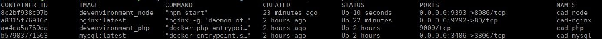

# Dev Environment für Code + Design Camps

Es ist immer schwierig um bei ersten Codings auf den selben technischen Stand zu kommen. Doch das installieren der Umgebung sollte meines 
Erachtens kein Hinderungsgrund zum Programmieren sein. Darum soll diese kleine Docker-Umgebung ein Anfang sein um 
den Teilnehmern eine Umgebung bereit zu stellen.

# Installation

Der Vorteil ist: Man muss nicht alles lokal auf seinem PC installieren, was unterschiedlichen Betriebsystemen sehr sehr
kompliziert werden kann. Darum brauchen wir hier "nur" ein Tool mit dem Namen [Docker](https://www.docker.com/). Dieses Tool
stellt uns die Programme, die wir zum Ausführen und Anzeigen brauchen in einem sog. Container bereit. Wir können gerne am Camp
darüber reden wir das funktioniert. Hier sollten wir es uns einfach nur nach [Anleitung](https://docs.docker.com/install/) einfach nur
installieren. Linux-Umgebungen dürfen das gerne in Ihrer Konsole tun. Da reicht dann schon meist ein `sudo apt install docker` aus.
Damit wären wir eigentlich schon fertig. Doch ein Tool würde ich gerne noch dazu schmeißen: [docker-compose](https://docs.docker.com/compose/install/),
weil es uns hilft Docker Container einfacher zusammen zu stacken. So definiere ich alles einfach nur wie hier ein einer
`docker-compose.yml` und es funktioniert

# Usage

Wie wollen wir diese Dev-Environment benutzen? Ich würde sagen, sie dient nur als Anfang oder Einstieg. Wenn ich lokal oder in meinem Projekt
ein wenig mehr brauch sollten ich anfangen dies hier zu erweitern. D.h. ich lege bspw. einfach neue vhosts an indem ich
die `.docker/web/default.dev.conf` dupliziere und neu konfiguriere. Ebenso könnte man das [Dockerfile](./.docker/php/Dockerfile) auch um
neue Module (bsp: mongodb) ergänzen. Tut einfach was ihr mögt. Ergänzt dieses, wenn ihr denkt es könnte allgemein nützlich sein oder
forkt das ganze Repo, wenn ihr es in eurem Prozess einbinden wollt.

So sähe erst einmal unser Anfang aus:



# Start

Zum hochfahren der Container führe ich einfach folgenden Befehl aus:
```bash
docker-compose up -d 
```
Um in einem Container etwas auszuführen:
```bash
docker exec -it [container-name] bash 
```
Damit lande ich "in" dem Container und kann mich dort wie in einem Unix-System bewegen. will ich nur ein Command absetzen langt hier
schon:
```bash
	  docker exec [container-name] bash -c "cd /mnt/code && ls -l"
```
Das beste ist: Sprecht mich einfach an, ich bin der mit dem kleinen Roller und dem Bart.
